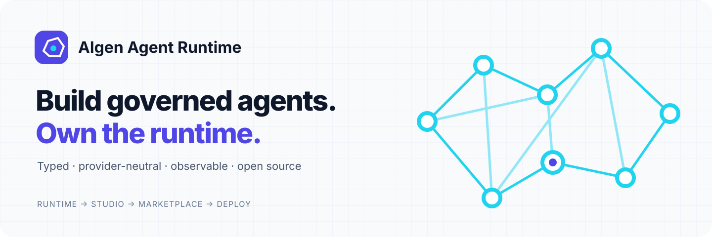
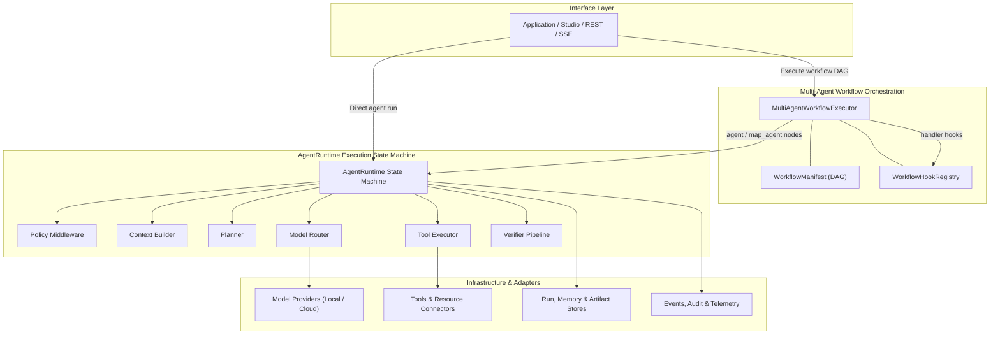

<picture>
  <source media="(prefers-color-scheme: dark)" srcset="docs/assets/brand/banner-dark.svg">
  <source media="(prefers-color-scheme: light)" srcset="docs/assets/brand/banner-light.svg">
  
</picture>

# Algen Agent Runtime

[](https://github.com/AlgenAI/algen-agent-runtime/actions/workflows/quality.yml)
[](https://github.com/AlgenAI/algen-agent-runtime/actions/workflows/security.yml)
[](https://www.python.org/downloads/)
[](LICENSE)

Algen Agent Runtime is a typed, provider-neutral Python runtime for building governed AI agents. It provides deterministic execution state, model routing, tool controls, human approvals, retrieval, verification, durable stores, streaming events, and OpenTelemetry instrumentation without binding applications to one model vendor or agent framework.

> [!IMPORTANT]
> `0.1.0a1` is a pre-release, single-node foundation. The repository is suitable for evaluation and contribution, but it is not yet presented as a production distributed control plane. Review the [known production gaps](docs/production-readiness.md), [threat model](docs/threat-model.md), and [security policy](SECURITY.md) before deployment.

## Why Algen Agent Runtime?

- **Provider-neutral execution:** route across local and hosted model providers through typed contracts.
- **Governance in the execution path:** enforce policies, approvals, budgets, verification, and tenant boundaries around every run.
- **Durable and observable:** persist agent and multi-agent workflow checkpoints, events, conversations, approvals, artifacts, and tool-execution records with optional PostgreSQL and Redis adapters.
- **Governed artifact inputs:** stage tenant-scoped files with checksums, scan/quarantine state,
  expiry, metadata-only listing, and bounded retention before attaching them to a run.
- **Application-friendly:** use the same runtime as an embedded Python library or through its FastAPI REST/SSE service.
- **Runtime-owned multi-agent DAGs:** declare JSON-Schema inputs/outputs, agent, dynamic map-agent, deterministic-handler,
  predicate, and join nodes with conditions, bounded loops and repairs, clarification limits, and
  lifecycle events; compose exact-version child workflows without duplicating their topology.
- **Governed communications:** send validated, idempotency-aware email through a provider-neutral
  contract and TLS-first SMTP adapter while keeping attachments behind Runtime artifact references.
- **Extensible by design:** add model providers, tools, planners, context builders, verifiers, stores, and external-framework adapters without changing the state machine.
- **Offline-testable:** the deterministic mock provider supports tests without credentials, network access, or paid model calls.

## The Algen agent lifecycle

Runtime is the open-source execution foundation in a three-product lifecycle:

| Product | Role | Boundary |
| --- | --- | --- |
| **Algen Agent Runtime** | Build and execute portable, governed agents and multi-agent DAGs | Open-source Python library and service; owns execution contracts and semantics |
| **Algen Agent Studio** | Low-code build, test, evaluate, publish, and deploy workbench | Private product; consumes Runtime without redefining its workflow dialect |
| **Algen Agent Marketplace** | Discover, distribute, license, and import versioned agents | Public/private and free/paid catalog; packages agents but does not execute them |

An agent can be built directly with Runtime or visually in Studio. Studio validates and evaluates the
same Runtime project, publishes a versioned package to Marketplace, and deploys it with
environment-specific credentials. Marketplace consumers import that package into Studio before
configuration and deployment. Secrets and live environment values never belong in a marketplace
artifact.

Typed workflows can reference staged file IDs rather than embedding bytes. See the
[artifact lifecycle](docs/artifacts.md) for upload, checksum, quarantine, retention, and storage
boundaries.

Workflows can also call exact, trusted child workflow versions through a `WorkflowRegistry`; Runtime
preserves correlation, lineage, checkpoints, pause/approval propagation, and recovery. See
[multi-agent workflows](docs/multi-agent-workflows.md) and the importable
`examples/pattern_child_workflow`. For governed outbound messages, see [email](docs/email.md).

## Status and support

| Area | Status |
| --- | --- |
| Python | 3.12 and 3.13 |
| Package maturity | Pre-alpha (`0.1.0a1`) |
| Core execution | Available and covered by deterministic tests |
| HTTP API | Available; secure deployment configuration is operator-owned |
| Persistence | In-memory, PostgreSQL, and Redis adapters |
| Artifact storage | Memory, PostgreSQL, and encrypted S3-compatible object storage |
| Distributed execution | Experimental; see the production-readiness roadmap |
| Public API compatibility | Experimental during `0.x`; see the [API stability policy](docs/api-stability.md) |
| Community support | Best effort; see [SUPPORT.md](SUPPORT.md) |

## Install

Install the latest package from PyPI:

```bash
python -m pip install algen-agent-runtime
# Or for pre-release builds:
python -m pip install --pre algen-agent-runtime
```

Optional integrations are installed as extras:

```bash
# Storage, cache, auth
python -m pip install --pre 'algen-agent-runtime[postgres,redis,auth]'

# Model Context Protocol (MCP) client
python -m pip install --pre 'algen-agent-runtime[mcp]'

# External framework adapters
python -m pip install --pre 'algen-agent-runtime[langgraph]'
```

Direct install from a pinned GitHub release tag:

```bash
python -m pip install git+https://github.com/AlgenAI/algen-agent-runtime.git@v0.1.0a1
```

For development from a checkout:

```bash
git clone https://github.com/AlgenAI/algen-agent-runtime.git
cd algen-agent-runtime
python3.12 -m venv .venv
source .venv/bin/activate
python -m pip install -e '.[dev]'
```

Verify your installation with the CLI:

```bash
algen-agent-runtime --help
```

Quickly scaffold a new agent project:

```bash
algen-agent-runtime new my-agent --template agent
cd my-agent
python app.py
```

## Five-minute offline quickstart

### Single agent

This example uses the built-in mock provider, so it requires no API key or external service:

```python
import asyncio

from algen_agent_runtime.config.settings import AppSettings
from algen_agent_runtime.orchestration.container import build_container
from algen_agent_runtime.runtime.client import AlgenAgentRuntimeClient
from algen_agent_runtime.types.contracts import RunRequest


async def main() -> None:
    settings = AppSettings.model_validate(
        {
            "providers": {
                "mock": {"type": "mock", "default_model": "deterministic"}
            },
            "agents": [
                {
                    "name": "hello",
                    "version": "1.0.0",
                    "description": "Offline quickstart agent",
                    "system_instructions": "Answer concisely.",
                    "default_model": {
                        "name": "default",
                        "provider": "mock",
                        "model": "deterministic",
                    },
                }
            ],
        }
    )
    container = build_container(settings)
    try:
        result = await AlgenAgentRuntimeClient(container.runtime).run(
            RunRequest(
                agent="hello",
                input="Hello",
                tenant_id="quickstart",
                user_id="local-user",
            )
        )
        print(result.output)
    finally:
        await container.aclose()


asyncio.run(main())
```

Expected output:

```text
Hello
```

### Multi-agent DAG workflow

Execute a multi-agent DAG with dynamic map-agent fan-out, evidence joining, and synthesis:

```python
import asyncio

from algen_agent_runtime.config.settings import load_settings
from algen_agent_runtime.orchestration.container import build_container
from algen_agent_runtime.runtime.client import AlgenAgentRuntimeClient
from algen_agent_runtime.workflows import MultiAgentWorkflowExecutor
from examples.pattern_multi_agent_fanout.hooks import create_hooks


async def main() -> None:
    settings = load_settings(("examples/pattern_multi_agent_fanout/agent.yaml",))
    container = build_container(settings)
    manifest = settings.workflows["multi-agent-fanout"]
    hooks = create_hooks(container=container, manifest=manifest)
    try:
        executor = MultiAgentWorkflowExecutor(
            AlgenAgentRuntimeClient(container.runtime),
            hooks,
            store=container.workflow_checkpoints,
        )
        state = await executor.run(
            manifest,
            {"question": "Assess a migration to managed queues"},
            tenant_id="quickstart",
            user_id="local-user",
        )
        print(state.values["answer"]["summary"])
    finally:
        container.close()


asyncio.run(main())
```

Expected output:

```text
Completed bounded parallel research for: Assess a migration to managed queues
```

For a real local model, follow the [Ollama quickstart](examples/quickstart_local_chat/README.md).

## CLI & Project Scaffolding

Algen Agent Runtime provides a CLI for project scaffolding and serving runtime endpoints:

```bash
# Scaffold a new agent project (templates: agent, approval, workflow)
algen-agent-runtime new my-agent
algen-agent-runtime new my-approval-agent --template approval
algen-agent-runtime new my-workflow-agent --template workflow

# Test and run the scaffolded project offline
cd my-agent
python app.py
pytest
```

## Run the HTTP service

From a source checkout with Ollama running and `llama3.2` installed:

```bash
ALGEN_AGENT_RUNTIME_CONFIG=examples/quickstart_local_chat/agent.yaml \
  algen-agent-runtime serve
```

Alternatively, invoking `algen-agent-runtime` without subcommands defaults to `serve` for backward compatibility.

The default bind is `127.0.0.1:8000`. Development-header authentication is intentionally limited to loopback unless the insecure-development override is explicitly enabled.

Start a run:

```bash
curl --fail-with-body -X POST http://127.0.0.1:8000/v1/runs \
  -H 'content-type: application/json' \
  -H 'x-tenant-id: demo' \
  -H 'x-user-id: user-1' \
  -H 'x-scopes: runs:write' \
  -d '{"agent":"minimal","input":"Hello"}'
```

Production deployments should use verified JWT authentication, TLS termination, durable stores, explicit CORS rules, secret references, and infrastructure-level resource controls. See the [operations guide](docs/operations.md).

## Architecture



The orchestration layer depends on typed contracts rather than provider SDKs. The composition root resolves configured adapters and registries, while applications retain ownership of domain prompts, metrics, tools, policies, and data access.

See the full [architecture guide](docs/architecture.md) for the state machine, component boundaries, persistence model, and extension points.

## Capabilities

| Capability | Included |
| --- | --- |
| Execution | Checkpointed state machine, retries, cancellation, timeouts, resumability |
| Models | Capability-aware routing, fallback, local and OpenAI-compatible adapters |
| Tools | Typed schemas, permissions, idempotency, approvals, execution ledger |
| Retrieval | Keyword, vector, and hybrid retrieval with citation verification |
| Governance | Policies, budgets, redaction, network controls, human-in-the-loop decisions |
| Conversations | Durable messages, feedback, follow-ups, SSE, rich response blocks |
| Analytics | Typed analytical DAGs, application-registered nodes, secret-safe query sources, semantic layers, governance and evaluation gates |
| Multi-agent workflows | Validated manifests, dependency scheduling, dynamic fan-out, bounded repair, exact-version child composition, durable clarification and approval pause/resume, explicit crash recovery, typed resources, correlation, and lifecycle events |
| Communications | Validated email contracts, artifact references, idempotency-aware tool execution, and a TLS-first SMTP adapter |
| Observability | Structured logs, OpenTelemetry, optional Traccia integration |
| Frameworks | Optional LangGraph, OpenAI Agents, AutoGen, and CrewAI adapters |

Provider and integration dependencies remain optional. See the [provider compatibility matrix](docs/provider-compatibility.md) and [framework adapter guide](docs/framework-adapters.md).

## Documentation

| Topic | Guide |
| --- | --- |
| Product fit and boundaries | [Why Algen Agent Runtime](docs/why-algen-agent-runtime.md) |
| Architecture | [Architecture](docs/architecture.md) |
| Deployment and configuration | [Operations](docs/operations.md) |
| Providers | [Provider extension](docs/providers.md) and [compatibility](docs/provider-compatibility.md) |
| Retrieval | [RAG](docs/rag.md) |
| Analytical agents | [Analytical runtime](docs/analytical-runtime.md) and [semantic layer](docs/semantic-layer.md) |
| Multi-agent workflows | [Workflow manifests and executor](docs/multi-agent-workflows.md) |
| Security | [Threat model](docs/threat-model.md) and [security policy](SECURITY.md) |
| Production limitations | [Production readiness](docs/production-readiness.md) |
| Compatibility promises | [API stability](docs/api-stability.md) |
| Releases | [Release process](docs/releasing.md) and [changelog](CHANGELOG.md) |
| Repository operators | [Public repository settings](docs/repository-settings.md) |

## Importable examples

The source and wheel distributions include the `examples` package so portable workflow hook
providers remain importable by Algen Agent Studio. Import an example directory—or its `agent.yaml`
or `config/agent.yaml`—and Studio preserves the Runtime `WorkflowManifest` exactly. Credential-free
examples use deterministic mock providers; service-backed case studies retain explicit prerequisites.

The workflow examples cover first-class approve/modify/reject checkpoints, human clarification,
bounded repair, exact-version parent/child dispatch, dynamic fan-out,
parallel branches, joins, framework adapters, evaluation gates, and secret-free links to tools,
retrieval, memory, services, storage, and telemetry.

### Running examples from the CLI

Workflow examples can be executed directly from your terminal using deterministic mock providers without API keys:

```bash
# Multi-agent dynamic fan-out, evidence join, and synthesis
python -m examples.pattern_multi_agent_fanout.app "Assess a migration to managed queues"

# Deterministic handler and resource tool pattern
python -m examples.quickstart_tool.app

# Human approval checkpoint (interactive prompt, or automated with --approve-all)
python -m examples.pattern_approval_workflow.app --approve-all

# Governed research with retrieval and cited synthesis
python -m examples.pattern_governed_research.app
```

All workflow examples support non-interactive execution in automated environments and CI pipelines:
- `--approve-all`: automatically approve all approval checkpoints
- `--reject-all`: automatically reject all approval checkpoints
- `--answers-file PATH`: supply ordered approval/clarification decisions from a JSON file


## Development

```bash
make install
make lint
make typecheck
make test
```

### AI coding skills

Repository-scoped skills under [`.agents/skills`](.agents/skills) help coding agents use the current
Runtime contracts instead of inventing parallel abstractions:

- `algen-runtime-contributor` — safe, compatible open-source contributions;
- `algen-runtime-extension` — providers, tools, stores, retrieval, telemetry, and framework adapters;
- `algen-agent-builder` — Studio-importable single-agent and multi-agent projects;
- `algen-agent-connector` — governed combinations of APIs, MCP, databases, retrieval, memory,
  persistence, and telemetry.

Invoke a skill by name when supported by your coding agent, for example:

```text
Use $algen-agent-builder to create a multi-agent support workflow with CRM reads,
approval-gated ticket updates, deterministic tests, and a Studio-importable manifest.
```

The complete contributor workflow, architecture rules, DCO requirement, and test expectations are in [CONTRIBUTING.md](CONTRIBUTING.md). Project decision-making and maintainership are documented in [GOVERNANCE.md](GOVERNANCE.md) and [MAINTAINERS.md](MAINTAINERS.md).

## Security

Do not report vulnerabilities in public issues. Use GitHub private vulnerability reporting as described in [SECURITY.md](SECURITY.md). Never include live credentials, private prompts, customer data, or production endpoints in reports or test fixtures.

## License

Licensed under the [Apache License 2.0](LICENSE). Third-party components retain their respective licenses. See [NOTICE](NOTICE).
