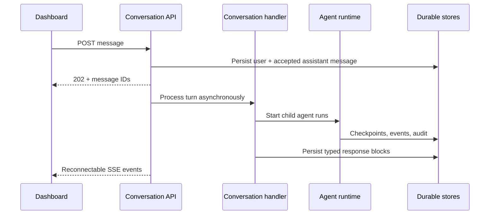
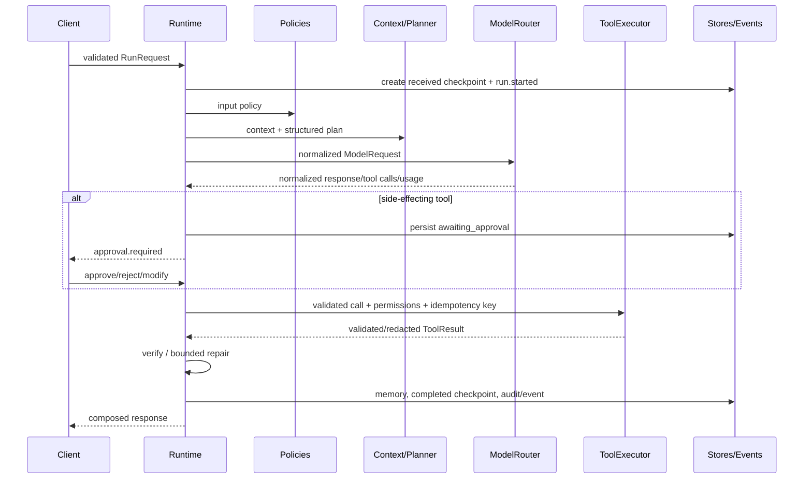

# Architecture and key decisions

## Conversation application boundary

Algen Agent Runtime exposes a generic durable conversation layer above individual runs. A conversation
handler maps a user turn to one or more child agent runs and returns presentation-neutral content
blocks. Conversation, message, event, run, parent-run, workflow-run, tenant, and user identifiers are
preserved independently, so a UI session is not conflated with a model invocation.

Handlers are plugins: the core has no analytics, SQL, or dashboard-specific behavior. Interrupted
conversation responses are marked retryable rather than automatically replayed, because a generic
handler may own externally visible side effects whose idempotency is unknown.

## Boundaries

`types` owns normalized contracts. `runtime` owns legal transitions and termination. `planning`, `context`, `policies`, `verification`, `responses`, and `tools` are independent strategies. `models/providers`, `persistence`, and `api` are adapters. `orchestration/container.py` is the only default composition root.

Key decisions:

1. Runs use optimistic versioning. A resume or worker may update only the checkpoint version it loaded.
2. Side-effecting calls carry `run_id:tool_call_id` idempotency keys. Approval and a tool-execution
   reservation persist before execution. Completed results are replayable; interrupted side effects
   become indeterminate and require reconciliation.
3. Plans are strict models with unique IDs and backward-only dependencies. The runtime executes only registered action kinds, enabled tools, and allowed models.
4. Capability discovery happens before routing. Unhealthy, disallowed, or incapable models are excluded; the router then uses quality and observed latency.
5. Paused states are durable. Active asyncio tasks are an optimization, not the durable source of
   truth. Agent turns recover on startup; analytical graphs additionally support PostgreSQL
   checkpoints and lease-based distributed work claims.
6. Core storage defaults to isolated in-memory adapters. PostgreSQL can persist every execution
   record; Redis provides checkpoints and expiring session memory.
7. Diagnostic logs and immutable audit contracts are separate. Both pass through redaction before export.
8. Observability uses OpenTelemetry contracts. Standard OTLP is built in; the optional Traccia adapter owns only SDK lifecycle and per-run agent identity, leaving runtime instrumentation vendor-neutral.
9. RAG is a composition of `DocumentIndexer`, `Retriever`, `RetrievalContextBuilder`, and citation-verification contracts. Tenant filtering happens before ranking, retrieved content is marked as untrusted data, and vector-store adapters remain outside orchestration.
10. Caching is a port, not a provider assumption. In-memory and Redis adapters implement the same
    contract. Policies select global, tenant, user, session, or run scope independently for model
    capabilities, retrieval, exact model responses, and safe tool results. Only hashed identity and
    request material enter keys. Cache failures are fail-open; side-effecting tools are never cached.
11. Analytical orchestration is a separate typed DAG. Node outputs remain individually addressable;
    method/model-service/query-governance/evaluation contracts are domain-neutral, while formulas and
    model implementations are registered by applications.
12. Query permission is distinct from model permission. Source trust, purpose, metric/column access,
    workload quotas, fingerprints, exports and cache scope are checked before the database, whose RLS
    and grants remain authoritative.

See [Analytical Runtime](analytical-runtime.md) for the graph and extension contracts.

## Execution flow

## Configuration precedence

Built-in defaults are merged with YAML files, `ALGEN_AGENT_RUNTIME__` nested environment variables, and deployment overrides. Agent and request settings are resolved by orchestration; request overrides are strict and should be allowlisted by deployments. Unknown fields fail validation.
